# ANSIBLE CONFIGURATION MANAGEMENT (AUTOMATE PROJECT 7 TO 10)

In Projects 7 to 10 we perform a lot of manual operations to set up virtual servers, install and configure required software and deploy our web application.

This Project will make us appreciate `DevOps tools` even more by making most of the routine tasks automated with [Ansible Configuration Management](https://www.redhat.com/en/topics/automation/what-is-configuration-management#:~:text=Configuration%20management%20is%20a%20process,in%20a%20desired%2C%20consistent%20state.&text=Managing%20IT%20system%20configurations%20involves,building%20and%20maintaining%20those%20systems.), at the same time we will become confident with writing code using declarative languages such as YAML.

## Ansible Client as a Jump Server (Bastion Host)

A Jump Server (also known as a Bastion Host) acts as an intermediary gateway, providing controlled access to a secured internal network. In an ideal architecture, web servers are located within a private network, isolated from direct internet access to enhance security. This setup restricts even DevOps engineers from directly SSHing into web servers; instead, they access these servers through the Jump Server. By funneling access through a single entry point, the Jump Server strengthens security, minimizes the attack surface, and serves as a central point for monitoring and controlling access to the internal environment.

## Task

- Install and configure Ansible client to act as a Jump Server/Bastion Host
- Create a simple Ansible playbook to automate servers configuration

On the diagram below the Virtual Private Network (VPC) is divided into two subnets - Public subnet has public IP addresses and Private subnet is only reachable by private IP addresses.

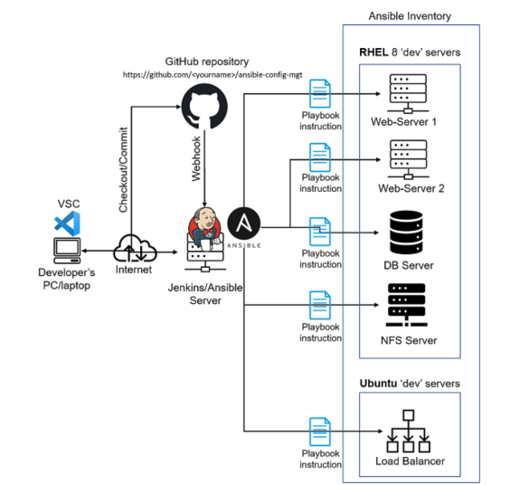


## Step 1 - Install and Configure ANSIBLE ON EC2 Instance

### 1. Update `Name` tag on your Jenkins EC2 Instance to `Jenkins-Ansible`. We will use this server to run playbooks.

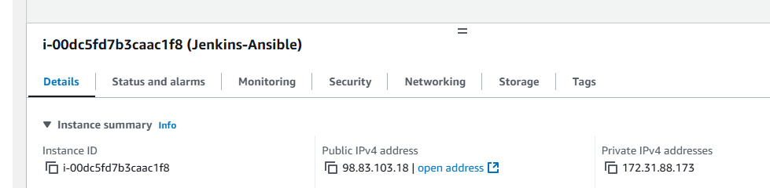

### 2. In your GitHub account create a new repository and name it ansible-config-mgt

### 3. Instal Ansible ([See: install ansible with pip](https://docs.ansible.com/ansible/latest/installation_guide/intro_installation.html#installing-ansible-with-pip))

```
sudo apt update
```
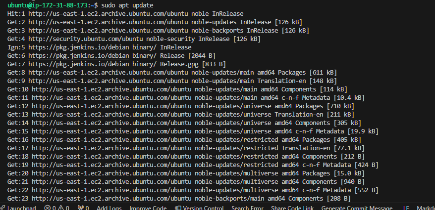

```
sudo apt install ansible
```


__Check your ansible version__

```
ansible --version
```
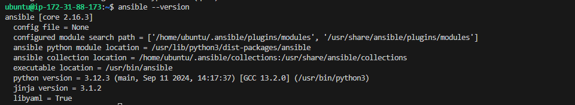

### 4. Configure Jenkins build job to save your repository content every time you change it – this will solidify your Jenkins configuration skills acquired in Project 9

- Configure a Webhook in GitHub and set the webhook to trigger `ansible` build.
On `ansible-config-mgt` repository, select Settings > Webhooks > Add webhook

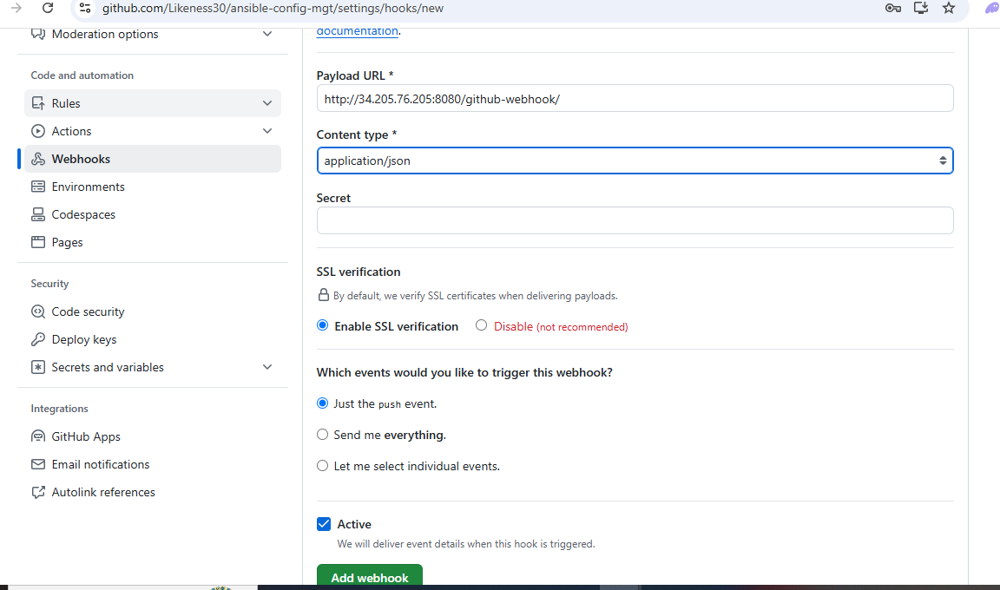

- Create a new Freestyle project `ansible` in Jenkins


- Point it to the `ansible-config-mgt` repository
Copy the repository URL

In configuration of our `ansible` freestyle project choose `Git`, provide there the link to our `ansible-config-mgt` GitHub repository and credentials (user/password) so Jenkins could access files in the repository.

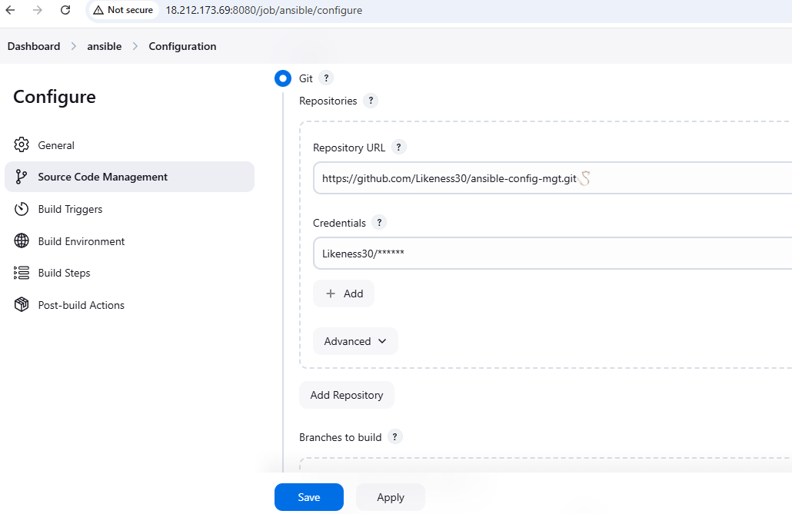

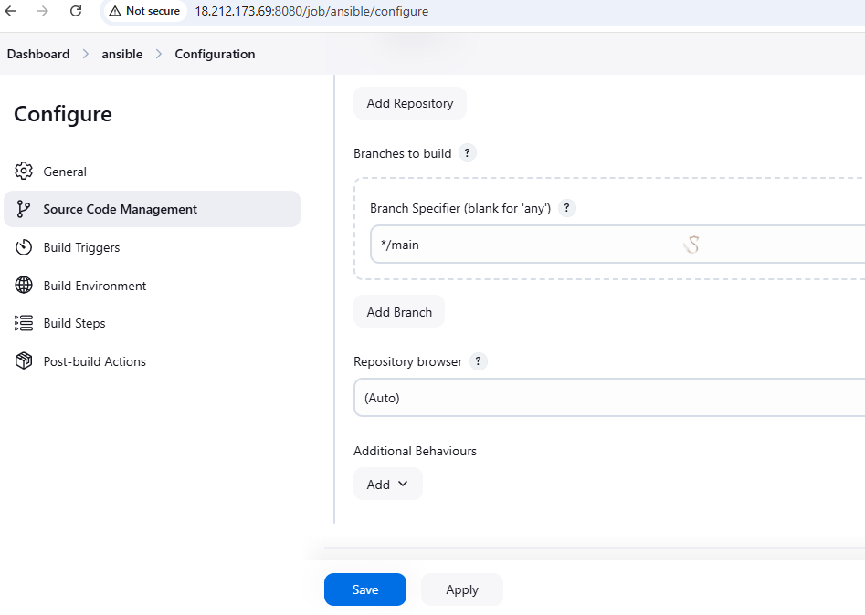

- Configure a Post-build job to save all (**) files, like you did it in [Project 9](https://github.com/francdomain/StegHub_DevOps-Cloud_Engineering/blob/main/Tooling-Website-Deployment-Automation-With-CI/Tooling_Website_Deploment_With_CI.md).

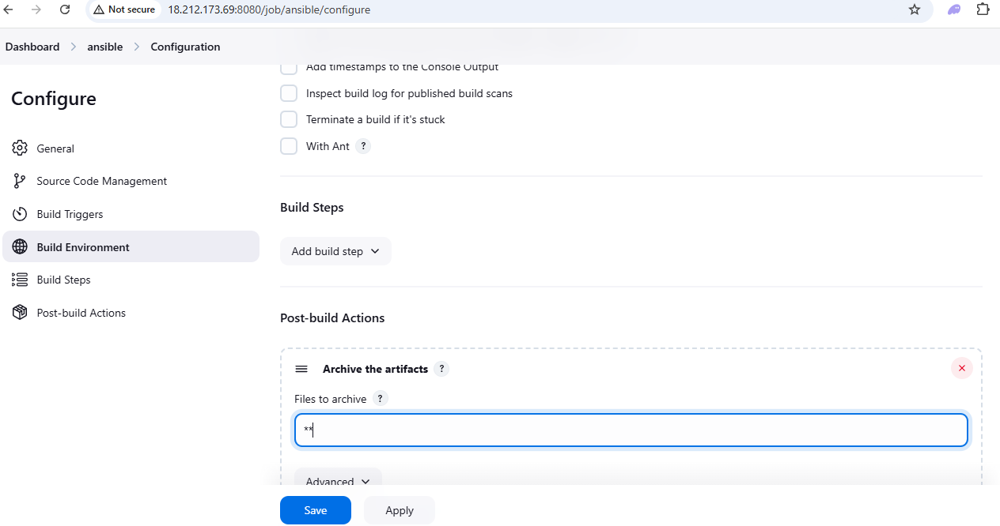

### 5. Test your setup by making some change in README.MD file in `master` branch and make sure that builds starts automatically and Jenkins saves the files (build artifacts) in following folder

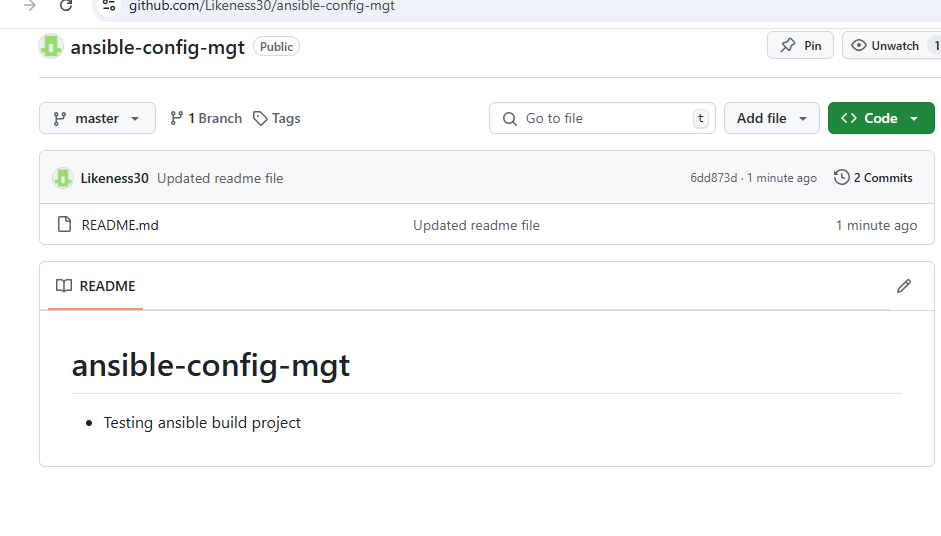

Check `ansible` project on jenkins for the build

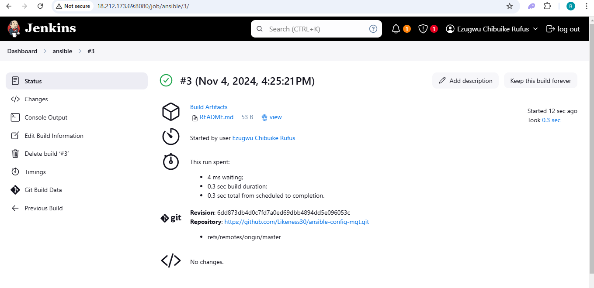

Console output

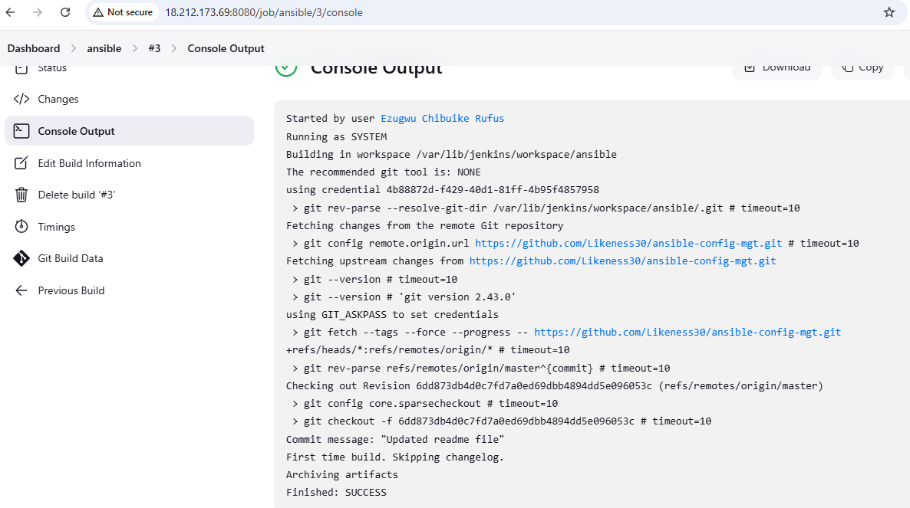

```
ls /var/lib/jenkins/jobs/ansible/builds/<build_number>/archive/
```
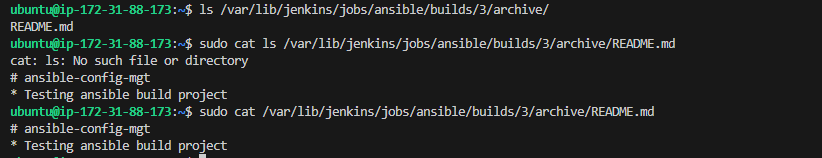
__Note:__ Trigger Jenkins project execution only for /main (master) branch.

Now your setup will look like this:

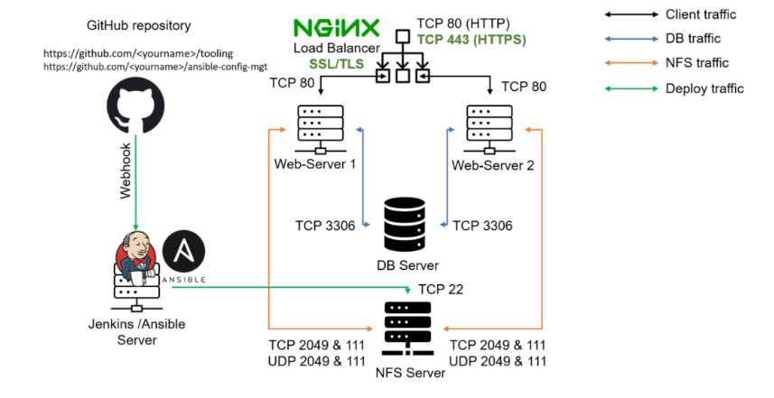

__Tip__: Allocate an Elastic IP to your Jenkins-Ansible server to avoid reconfigure of GitHub webhook to a new IP address anytime you stop/start your Jenkins-Ansible server.

Allocate elastic IP


Associate the elastic IP

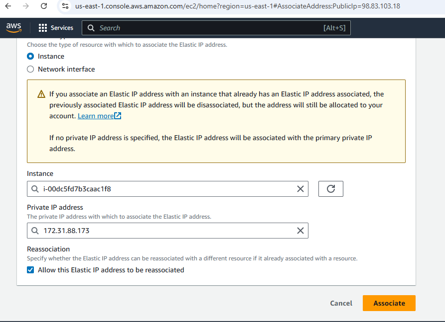

Update the webhook

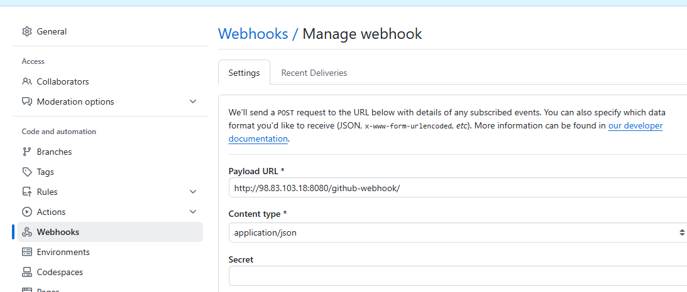

__Note:__ Elastic IP is free only when it is being allocated to an EC2 Instance, so do not forget to release Elastic IP once you terminate your EC2 Instance.


## Step 2 – Prepare your development environment using Visual Studio Code

### 1. First part of `DevOps` is `Dev`, which means you will require to write some codes and you shall have proper tools that will make your coding and debugging comfortable – you need an Integrated development environment (IDE) or Source-code Editor.
There is a plethora of different IDEs and Source-code Editors for different languages with their own advantages and drawbacks, you can choose whichever you are comfortable with, but we recommend one free and universal editor that will fully satisfy your needs – [Visual Studio Code (VSC)](https://code.visualstudio.com/download).

### 2. After you have successfully installed `VSC`, configure it to connect to your newly created GitHub repository.

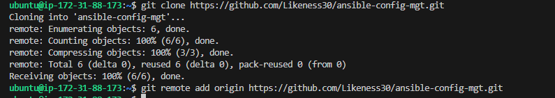

```
https://github.com/francdomain/ansible-config-mgt.git
```

### 3. Clone down your ansible-config-mgt repo to your Jenkins-Ansible instance git clone `<ansible-config-mgt repo link>`


## Step 3 - Begin Ansible Development

### 1. In your ansible-config-mgt GitHub repository, create a new branch that will be used for development of a new feature

__Tip:__ Give your branches descriptive and comprehensive names, for example, if you use Jira or Trello as a project management tool - include ticket number (e.g. PRJ-num) in the name of your branch and add a topic and a brief description what this branch is about - a bugfix, hotfix, feature, release (e.g. feature/prj-145-lvm)

```
git checkout -b feature/prj-11-ansible-config
```
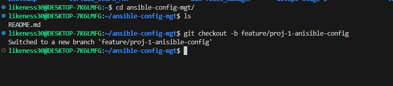

### 2. Checkout the newly created feature branch to your local machine and start building your code and directory structure

```
git fetch
git checkout feature/prj-11-ansible-config
```
### 3. Create a directory and name it `playbooks` - it will be used to store all your playbook files.

```
mkdir playbooks
```

### 4. Create a directory and name it `inventory` - it will be used to keep your hosts organised

```
mkdir inventory
```
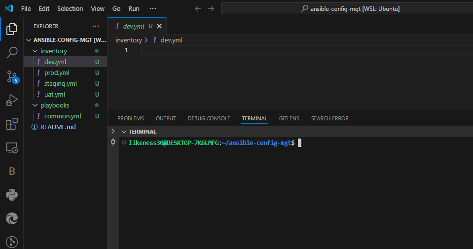

### 5. Within the playbooks folder, create your first playbook, and name it common.yml

```
touch playbooks/common.yml
```
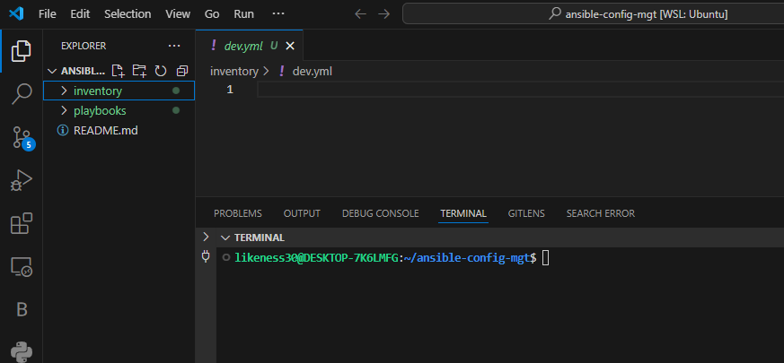


### 6. Within the inventory folder, create an inventory file (.yml) for each environment (Development, Staging, Testing and Production) dev, staging, uat, and prod respectively.

```
touch inventory/dev.yml inventory/staging.yml inventory/uat.yml inventory/prod.yml
```
These inventory files use .ini languages style to configure Ansible hosts.

## Step 4 - Set up an Ansible Inventory

An Ansible inventory file defines the hosts and groups of hosts upon which commands, modules, and tasks in a playbook operate. Since our intention is to execute Linux commands on remote hosts, and ensure that it is the intended configuration on a particular server that occurs. It is important to have a way to organize our hosts in such an Inventory

Save the below inventory structure in the `inventory/dev` file to start configuring your development servers. Ensure to replace the IP addresses according to your own setup.

__Note:__ Ansible uses TCP port 22 by default, which means it needs to ssh into target servers from Jenkins-Ansible host - for this you can implement the concept of [ssh-agent](https://smallstep.com/blog/ssh-agent-explained/). Now you need to import your key into `ssh-agent`:

To learn how to setup SSH agent and connect VS Code to your Jenkins-Ansible instance, please see this video:

- For Windows users - [ssh-agent on windows](https://www.youtube.com/watch?v=OplGrY74qog)
- For Linux users - [ssh-agent on linux](https://www.youtube.com/watch?v=OplGrY74qog)


__Start the SSH Agent:__

This starts the `SSH agent` in your current terminal session and sets the necessary environment variables.

```
eval `ssh-agent -s`
```
__Add Your SSH Key:__

Add your `SSH private key` to the agent. replace the path with the correct path to the private key.

```
ssh-add <path-to-private-key>
```
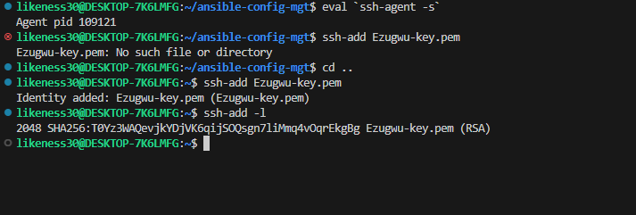

__Verify the Key is Loaded:__

Check that your key has been successfully added to the SSH agent. you should see the name of your key

```
ssh-add -l
```
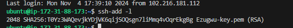

__Now, ssh into your Jenkins-Ansible server using ssh-agent__

```
ssh -A ubuntu@public-ip
```


To learn how to setup SSH agent and connect VS Code to your Jenkins-Ansible instance, See this video: [Windows](https://www.youtube.com/watch?v=OplGrY74qog) [Linux](https://www.youtube.com/watch?v=RRRQLgAfcJw)

Also notice, that your Load Balancer user is ubuntu and user for RHEL-based servers is ec2-user

__Update your `inventory/dev.yml` file with this snippet of code:__

```yaml
all:
  children:
    nfs:
      hosts:
        <NFS-Server-Private-IP-Address>:
          ansible_ssh_user: ec2-user
    webservers:
      hosts:
        <Web-Server1-Private-IP-Address>:
          ansible_ssh_user: ec2-user
        <Web-Server2-Private-IP-Address>:
          ansible_ssh_user: ec2-user
    db:
      hosts:
        <Database-Private-IP-Address>:
          ansible_ssh_user: ubuntu
    lb:
      hosts:
        <Load-Balancer-Private-IP-Address>:
          ansible_ssh_user: ubuntu
```
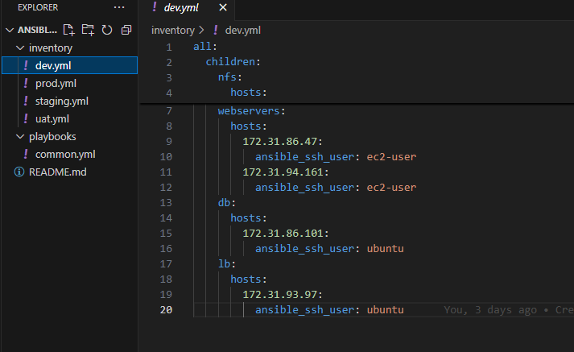


## Step 5 - Create a Common Playbook

It is time to start giving Ansible the instructions on what you need to be performed on all servers listed in `inventory/dev`

In `common.yml` playbook you will write configuration for repeatable, re-usable, and multi-machine tasks that is common to systems within the infrastructure.

__Update your `playbooks/common.yml` file with following code__

```yaml
---
- name: Update web and NFS servers
  hosts: webservers, nfs
  remote_user: ec2-user
  become: true
  become_user: root
  tasks:
    - name: Ensure wireshark is at the latest version
      yum:
        name: wireshark
        state: latest

- name: Update LB and DB servers
  hosts: lb, db
  remote_user: ubuntu
  become: true
  become_user: root
  tasks:
    - name: Update apt repo
      apt:
        update_cache: yes

    - name: Ensure wireshark is at the latest version
      apt:
        name: wireshark
        state: latest
```
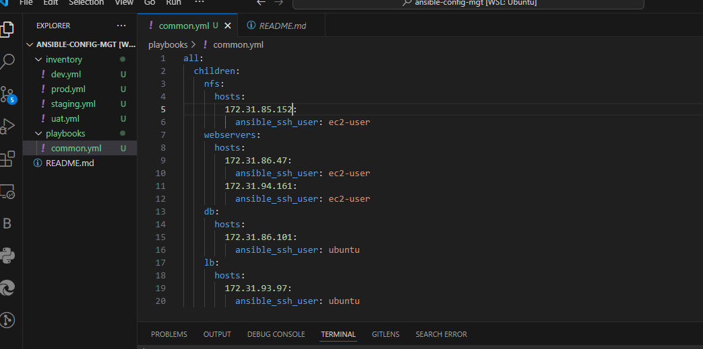

Examine the code above and try to make sense out of it. This playbook is divided into two parts, each of them is intended to perform the same task :

install `wireshark` utility (or make sure it is updated to the latest version) on your RHEL 9 and Ubuntu servers.
It uses root user to perform this task and respective package manager: `yum` for RHEL 9 and `apt` for Ubuntu.

Feel free to update this playbook with following tasks:

- Create a directory and a file inside it

- Change timezone on all servers

- Run some shell script

For a better understanding of Ansible playbooks - [watch this video from RedHat](https://www.youtube.com/watch?v=ZAdJ7CdN7DY) and read [this article](https://www.redhat.com/en/topics/automation/what-is-an-ansible-playbook) - What is an Ansible Playbook?


## Step 6 - Update GIT with the latest code

Now all of your directories and files live on your machine and you need to push changes made locally to GitHub.

`
In the real world, you will be working within a team of other DevOps engineers and developers. It is important to learn how to collaborate with help of GIT. In many organisations there is a development rule that do not allow to deploy any code before it has been reviewed by an extra pair of eyes - it is also called Four eyes principle.
`
Now you have a separate branch, you will need to know how to raise a `Pull Request (PR)`, get your branch peer reviewed and merged to the `main` branch.


__Commit your code into GitHub:__

1. Use git commands to add, commit and push your branch to GitHub.

```
git status

git add <selected files>

git commit -m "commit message"

git push origin <the feature branch>
```
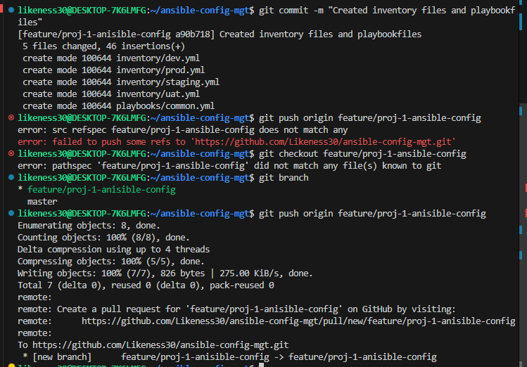


2. Create a Pull Request (PR)

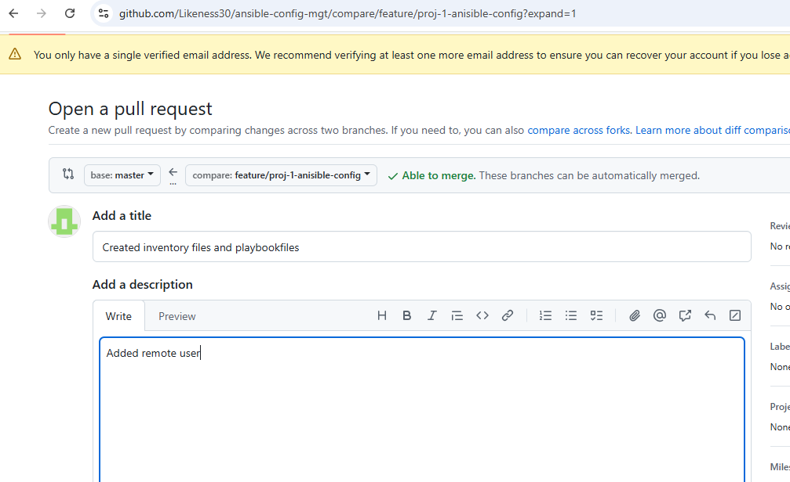

3. Wear the hat of another developer for a second, and act as a reviewer.


4. If the reviewer is happy with your new feature development, merge the code to the main branch.


5. Head back on your terminal, checkout from the feature branch into the master, and pull down the latest changes

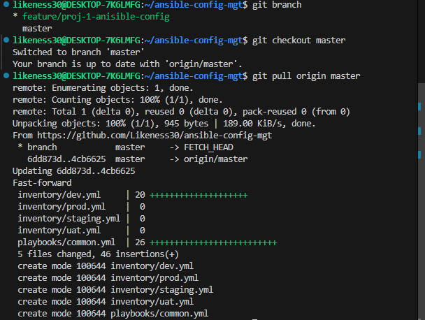

Once your code changes appear in main branch - Jenkins will do its job and save all the files (build artifacts) to


Console Output
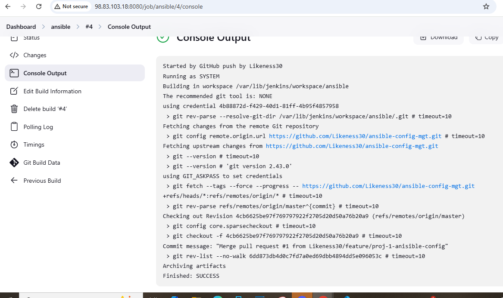

Check the artifact directory
```
/var/lib/jenkins/jobs/ansible/builds/<build_number>/archive/
```

## Step 7 - Run first Ansible test

Now, it is time to execute ansible-playbook command and verify if your playbook actually works: first setup our vs code to connect our instance for remote development, follow these steps:

1. Install Remote Development and Remote - SSH Extension

2. Configure the SSH Host

Another VSCODE opens showing the access mode and the name of the remote server (`SSH: jenkins-ansible`) at the top and at the bottom left conner. This indicates that we are now in the remote server


3. Run ansible-playbook command:

```
ansible-playbook -i inventory/dev.yml playbooks/common.yml
```
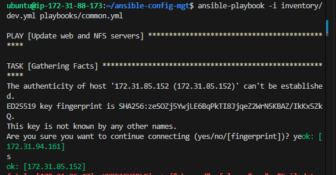

You can go to each of the servers and check if wireshark has been installed by running

```
which wireshark

or

wireshark --version
```

Check Web NFS server 

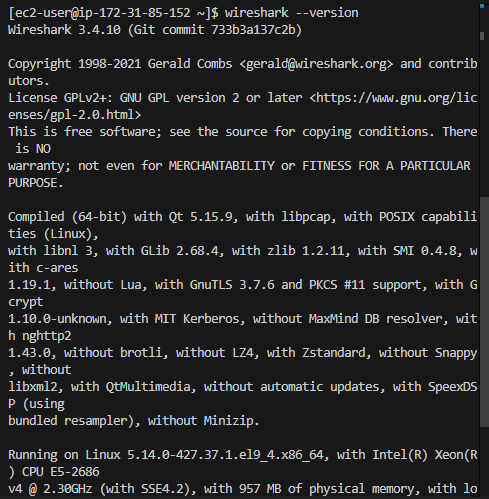

Your updated with Ansible architecture now looks like this:


## Optional step - Repeat once again

Update your ansible playbook with some new Ansible tasks and go through the full checkout -> change codes->commit -> PR -> merge -> build -> ansible-playbook cycle again to see how easily you can manage a servers fleet of any size with just one command!

i have just automated my routine tasks by implementing with Ansible configurations.