# Task - Implement a Client Server Architecture using MySQL Database Management System (DBMS)
Client-side architecture is basically the way two computers, servers, applications talk to one another. In their communication, each machine has its own role: the machine sending requests is usually referred as "Client" and the machine responding (serving) is called "Server".

In this context, the "client" is typically a user's web browser or an application that interacts with a server to request . It can also be said that two or more computers are connected together over a network to send and receive requests between one another.resources, display information, and perform user interactions. Here’s a breakdown of what client-side architecture involves

## The following instructions were followed to implement the above task:

### Step 1. Create and configure two linux-based virtual servers (EC2 instance in AWS)

- ```mysql server```
- ```mysql client```

__1.__ Two EC2 Instances of t3.micro type and Ubuntu 24.04 LTS (HVM) was lunched in the us-east-1 region using the AWS console.

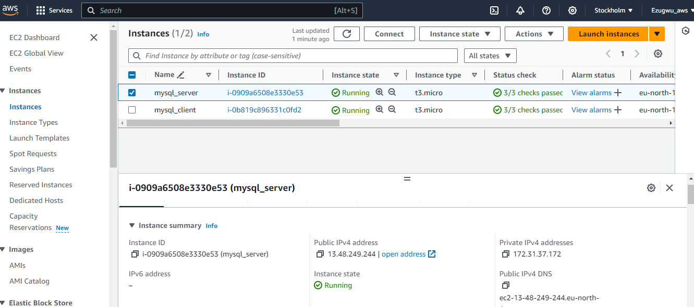

The security group inbound rule for both instances was configured with the default SSH on port 22 with source from anywhere.
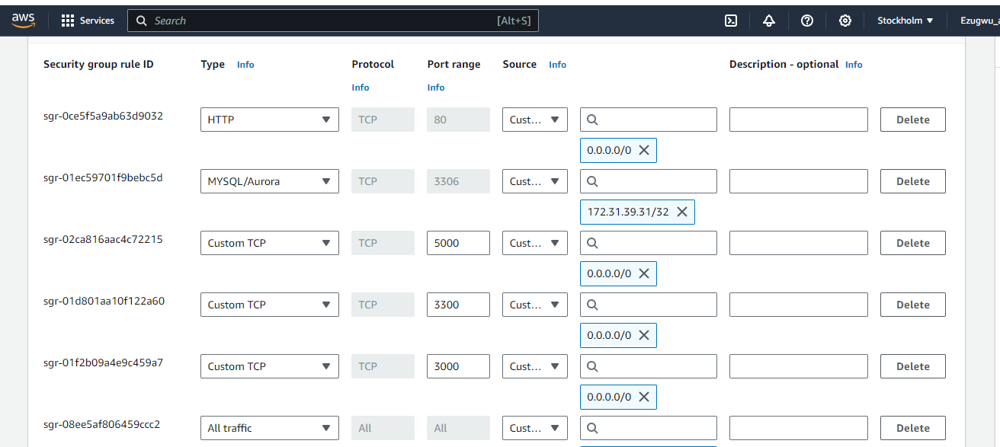

__2.__ Attached SSH key named __my-ec2-key__ to access the instance on port 22


## Step 2 - On ```mysql server``` Linux Server, install MySQL Server software

__1.__ The private ssh key permission was changed for the private key file and then used to connect to the instance by running

```bash
chmod 400 my-ec2-key.pem
```
```bash
ssh -i "ec2-key.pem" ubuntu@your-ip
```
Where __username=ubuntu__ and __public ip address=yourip__

__2.__ __Update and upgrade Ubuntu__

```bash
sudo apt update && sudo apt upgrade -y
```
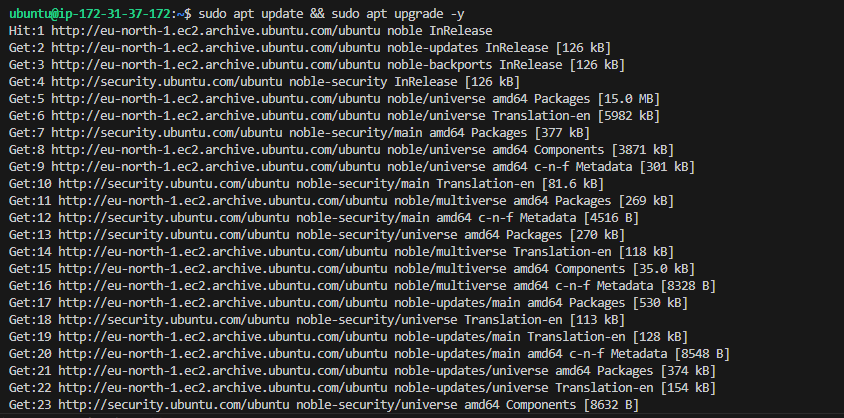

__3.__ __Install MySQL Server software__

```bash
sudo apt install mysql-server -y
```
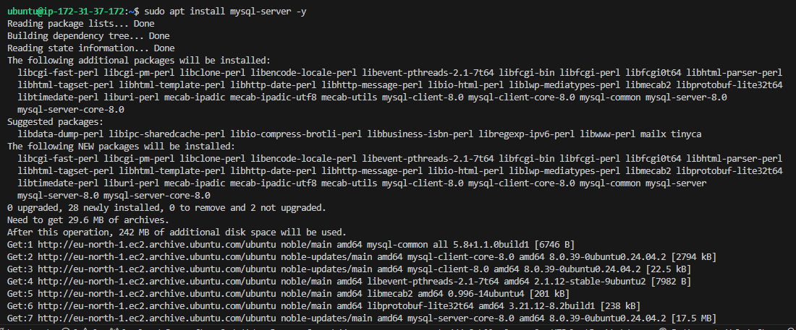


__4.__ __Enable mysql server__

```
sudo systemctl enable mysql
```
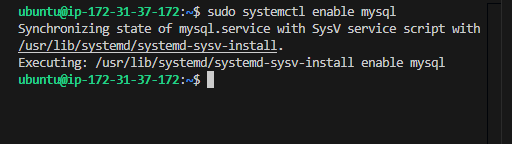

## Step 3 - On ```mysql client``` Linux Server install MySQL Client software.

__1.__ __Connect to the instance__

__2.__ __Update and upgrade Ubuntu__

```bash
sudo apt update && sudo apt upgrade -y
```

__3.__ __Install MySQL Client software__

```bash
sudo apt install mysql-client -y
```
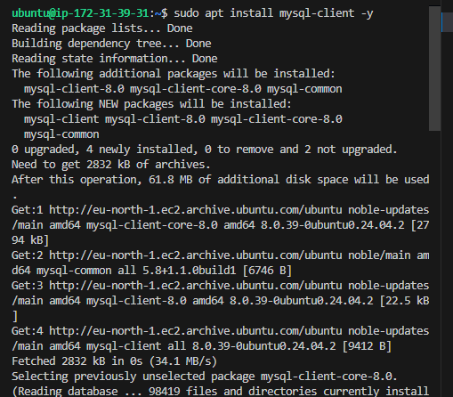

__4.__ __configure mysqld server confg file__
You might need to configure MySQL server to allow connections from remote hosts.

```
sudo vi /etc/mysql/mysql.conf.d/mysqld.cnf 
```

Allow all traffic or specify ip address and ports you want to allow to access yoyu database

__5.__ __Now, configure MySQL server to allow connections from remote hosts__.

```
sudo vim /etc/mysql/mysql.conf.d/mysqld.cnf
```
Locate ```bind-address = 127.0.0.1```

Replace ```127.0.0.1``` with ```0.0.0.0```
```
[mysqld]
bind-address = 0.0.0.0
port = 3306
datadir = /var/lib/mysql
```
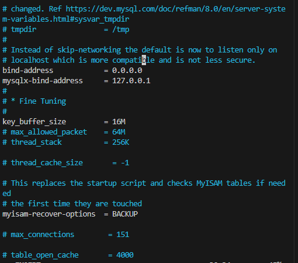


## Step 4 - Configure MySQL server to allow connections from remote hosts.

__Befor the configuration stated above, the following were implemented:__

__1.__ Access MySQL shell__

```
sudo mysql
```
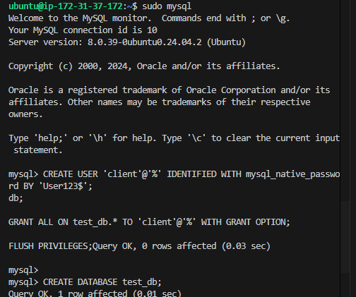

__2.__ On mysql server, create a user named ```your client``` and a database named ```your test_db```__.

```
CREATE USER 'client'@'%' IDENTIFIED WITH mysql_native_password BY 'User123$';

CREATE DATABASE test_db;

GRANT ALL ON test_db.* TO 'client'@'%' WITH GRANT OPTION;

FLUSH PRIVILEGES;
```

__Create table, insert rows into table and select from the table__

```
CREATE TABLE test_db.test_table (
  item_id INT AUTO_INCREMENT,
  content VARCHAR(255),
  PRIMARY KEY(item_id)
);

INSERT INTO test_db.test_table (content) VALUES ("My first choice football club is Chelsea");

INSERT INTO test_db.test_table (content) VALUES ("My second choice football club is R.Madrid");

SELECT * FROM test_db.test_table;
```

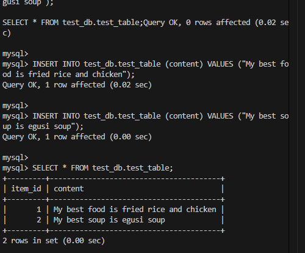


## Step 5 - From ```mysql client``` Linxus Sever, connect remotely to ```mysql server``` Database Engine without using SSH. The mysql utility must be used to perform this action.

```
sudo mysql -u client -h yourip -p
```
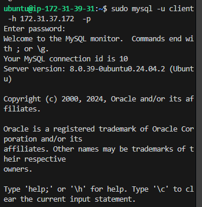


## Step 6 - Check that the connection to the remote MySQL server was successfull and can perform SQL queries.

```
show databases;
```
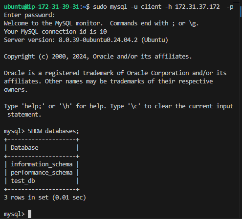

__Try to create something,create table, insert rows into table and select from the table__

```bash
CREATE TABLE test_db.test_table (
  item_id INT AUTO_INCREMENT,
  content VARCHAR(255),
  PRIMARY KEY(item_id)
);

INSERT INTO test_db.test_table (content) VALUES ("My best food is rice and chicken");

INSERT INTO test_db.test_table (content) VALUES ("My second soup is egusi soup");

SELECT * FROM test_db.test_table;
```


At this point, this project is successfully complete.
This deployment is a fully functional MySQL Client-Server set up.
