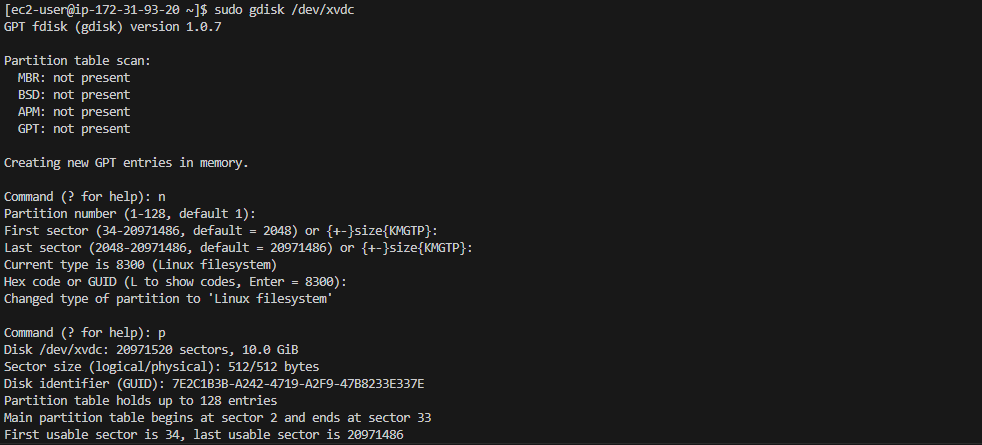
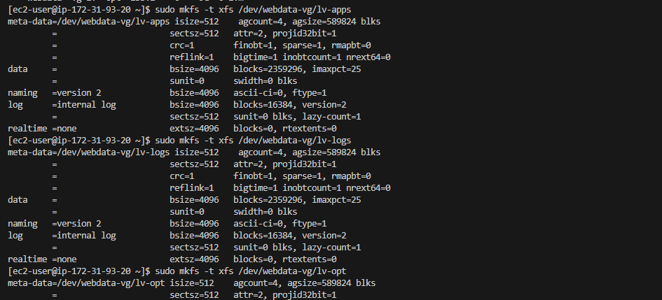
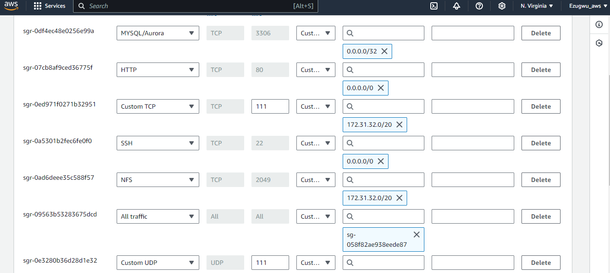
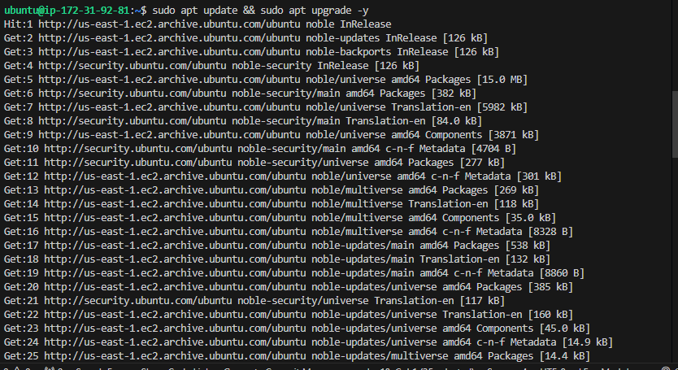
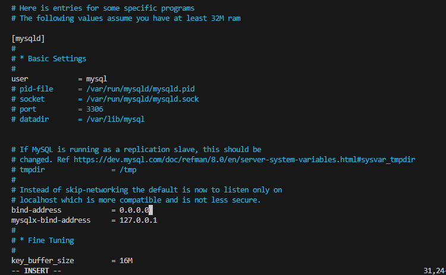
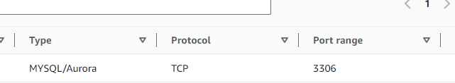
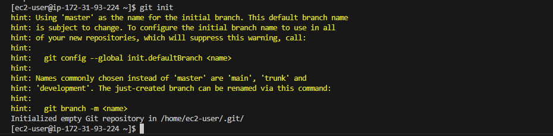

# DevOps Tooling Website Solution

## Introduction

__This project involves implementation of a solution that consists of the following components:__

- Infrastructure: AWS
- Web Server Linux: Red Hat Enterprise Linux 9
- Database Server: Ubuntu Linux + MySQL
- Sotrage Server: Red Hat Enterprise Linux 9 + NFS Server
- Programming Language: PHP
- Code Repository: GitHub

The diagram below shows the architecture of the solution.


## Step 1 - Prepare NFS Server

__1.__ __Spin up an EC2 instance with RHEL Operating System__


__2.__ __Configure Logical volume management on the server__

- Format the lvm as xfs
- Create 3 Logical volumes: lv-opt, lv-appa, lv-logs.
- Create mount points on /mnt directory for the logical volumes as follows:
  - Mount lv-apps on /mnt/apps - To be used by web servers
  - Mount lv-logs on /mnt/logs - To be used by web serveer logs
  - Mount lv-opt on /mnt/opt - To be used by Jenkins server in next project.

#### Create 3 volumes in the same AZ as the NFS Server ec2 each of 10GB and attache all 3 volumes one by one to the NFS Server.


#### Open up the Linux terminal to begin configuration.

```bash
ssh -i "my.pem" ec2-user@your-ip
```

#### Use ```lsblk``` to inspect what block devices are attached to the server. All devices in Linux reside in /dev/ directory. Inspect with ```ls /dev/``` and ensure all 3 newly created devices are there. Their name will likely be ```xvdf```, ```xvdg``` and ```xvdh```

```bash
lsblk
```


#### Use ```gdisk``` utility to create a single partition on each of the 3 disks

```bash
sudo gdisk /dev/xvdb
```


```bash
sudo gdisk /dev/xvdc
```


```bash
sudo gdisk /dev/xvdd
```


#### Use ```lsblk``` utility to view the newly configured partitions on each of the 3 disks

```bash
lsblk
```


#### Install ```lvm``` package

```bash
sudo yum install lvm2 -y
```


#### Use ```pvcreate``` utility to mark each of the 3 dicks as physical volumes (PVs) to be used by LVM. Verify that each of the volumes have been created successfully

```bash
sudo pvcreate /dev/xvdb1 /dev/xvdc1 /dev/xvdd1
sudo pvs
```


#### Use ```vgcreate``` utility to add all 3 PVs to a volume group (VG). Name the VG ```webdata-vg```. Verify that the VG has been created successfully

```bash
sudo vgcreate webdata-vg /dev/xvdb1 /dev/xvdc1 /dev/xvdd1
sudo vgs
```


#### Use ```lvcreate``` utility to create 3 logical volume, ```lv-apps```, ```lv-logs``` and ```lv-opt```. Verify that the logical volumes have been created successfully

```bash
sudo lvcreate -n lv-apps -L 9G webdata-vg
sudo lvcreate -n lv-logs -L 9G webdata-vg
sudo lvcreate -n lv-opt -L 9G webdata-vg

sudo lvs
```


#### Verify the entire setup

```bash
sudo vgdisplay -v   #view complete setup, VG, PV and LV
```


```bash
lsblk
```

#### Use ```mkfs -t xfs``` to format the logical volumes instead of ext4 filesystem

```bash
sudo mkfs -t xfs /dev/webdata-vg/lv-apps
sudo mkfs -t xfs /dev/webdata-vg/lv-logs
sudo mkfs -t xfs /dev/webdata-vg/lv-opt
```


#### Create mount point on ```/mnt``` directory

```bash
sudo mkdir /mnt/apps
sudo mkdir /mnt/logs
sudo mkdir /mnt/opt
```
```bash
sudo mount /dev/webdata-vg/lv-apps /mnt/apps
sudo mount /dev/webdata-vg/lv-logs /mnt/logs
sudo mount /dev/webdata-vg/lv-opt /mnt/opt
```


__3.__ __Install NFS Server, configure it to start on reboot and ensure it is up and running__.

```bash
sudo yum update -y
sudo yum install nfs-utils -y
```


```bash
sudo systemctl start nfs-server.service
sudo systemctl enable nfs-server.service
sudo systemctl status nfs-server.service
```


__4.__ __Export the mounts for Webservers' ```subnet cidr```(IPv4 cidr) to connect as clients. For simplicity, all 3 Web Servers are installed in the same subnet but in production set up, each tier should be separated inside its own subnet or higher level of security__

#### Set up permission that will allow the Web Servers to read, write and execute files on NFS.

```bash
sudo chown -R nobody: /mnt/apps
sudo chown -R nobody: /mnt/logs
sudo chown -R nobody: /mnt/opt

sudo chmod -R 777 /mnt/apps
sudo chmod -R 777 /mnt/logs
sudo chmod -R 777 /mnt/opt

sudo systemctl restart nfs-server.service
```


#### Configure access to NFS for clients within the same subnet (example Subnet Cidr - 172.31.32.0/20)

```bash
sudo vi /etc/exports

/mnt/apps 172.31.0.0/20(rw,sync,no_all_squash,no_root_squash)
/mnt/logs 172.31.0.0/20(rw,sync,no_all_squash,no_root_squash)
/mnt/opt 172.31.0.0/20(rw,sync,no_all_squash,no_root_squash)

sudo exportfs -arv
```


__5.__ __Check which port is used by NFS and open it using the security group (add new inbound rule)__

```bash
rpcinfo -p | grep nfs
```


__Note__: For NFS Server to be accessible from the client, the following ports must be opened: TCP 111, UDP 111, UDP 2049, NFS 2049.
Set the Web Server subnet cidr as the source




## Step 2 - Configure the Database Server

#### Launch an Ubuntu EC2 instance that will have a role - DB Server


#### Access the instance to begin configuration.

```bash
ssh -i "my.pem" ubuntu@your-ip
```

#### Update and upgrade Ubuntu

```bash
sudo apt update && sudo apt upgrade -y
```



__1.__ __Install MySQL Server__

#### Install mysql server

```bash
sudo apt install mysql-server
```


#### Run mysql secure script

```bash
sudo mysql_secure_installation
```


__2.__ __Create a database and name it ```tooling```__

__3.__ __Create a database user and name it ```webaccess```__

__4.__ __Grant permission to ```webaccess``` user on ```tooling``` database to do anything only from the webservers ```subnet cidr```__

```sql
sudo mysql

CREATE DATABASE tooling;
CREATE USER 'webaccess'@'172.31.32.0/20' IDENTIFIED WITH mysql_native_password BY 'Admin123$';
GRANT ALL PRIVILEGES ON tooling.* TO 'webaccess'@'172.31.32.0/20' WITH GRANT OPTION;
FLUSH PRIVILEGES;
show databases;

use tooling;
select host, user from mysql.user;
exit
```


#### Set Bind Address and restart MySQL

```bash
sudo vi /etc/mysql/mysql.conf.d/mysqld.cnf

sudo systemctl restart mysql
sudo systemctl status mysql
```




#### Open MySQL port 3306 on the DB Server EC2.

Access to the DB Server is allowed only from the ```Subnet Cidr``` configured as source.




## Step 3 - Prepare the Web Servers

There is need to ensure that the Web Servers can serve the same content from a shared storage solution, in this case - NFS and MySQL database. One DB can be accessed for ```read``` and ```write``` by multiple clients.
For storing shared files that the Web Servers will use, NFS is utilized and previousely created Logical Volume ```lv-apps``` is mounted to the folder where Apache stores files to be served to the users (/var/www).

This approach makes the Web server ```stateless``` which means they can be replaced when needed and data (in the database and on NFS) integrtity is preserved

In further steps, the following was done:
- Configured NFS (This step was done on all 3 servers)
- Deployed a tooling application to the Web Servers into a shared NFS folder
- Configured the Web Server to work with a single MySQL database

#### Web Server 1

__1.__ __Launch a new EC2 instance with RHEL Operating System__


__2.__ __Install NFS Client__

```bash
sudo yum install nfs-utils nfs4-acl-tools -y
```


__3.__ __Mount ```/var/www/``` and target the NFS server's export for ```apps```__.
NFS Server private IP address = 172.31.91.114

```bash
sudo mkdir /var/www
sudo mount -t nfs -o rw,nosuid 172.31.91.114:/mnt/apps /var/www
```

__4.__ __Verify that NFS was mounted successfully by running ```df -h```. Ensure that the changes will persist after reboot.__


```bash
sudo vi /etc/fstab
```

Add the following line
```bash
172.31.91.114:/mnt/apps /var/www nfs defaults 0 0
```


__5.__ __Install Remi's repoeitory, Apache and PHP__

```bash
sudo yum install httpd -y
```


```bash
sudo dnf install https://dl.fedoraproject.org/pub/epel/epel-release-latest-8.noarch.rpm
```


```bash
sudo dnf install dnf-utils http://rpms.remirepo.net/enterprise/remi-release-8.rpm
```


```bash
sudo dnf module reset php
```


```bash
sudo dnf module enable php:remi-8.2
```

```bash
sudo dnf install php php-opcache php-gd php-curl php-mysqlnd
```


```bash
sudo systemctl start php-fpm
sudo systemctl enable php-fpm
sudo systemctl status php-fpm

sudo setsebool -P httpd_execmem 1  # Allows the Apache HTTP server (httpd) to execute memory that it can also write to. This is often needed for certain types of dynamic content and applications that may need to generate and execute code at runtime.
sudo setsebool -P httpd_can_network_connect=1   # Allows the Apache HTTP server to make network connections to other servers.
sudo setsebool -P httpd_can_network_connect_db=1  # allows the Apache HTTP server to connect to remote database servers.
```


### Web Server 2

__1.__ __Launch another new EC2 instance with RHEL Operating System__

__2.__ __Install NFS Client__

```bash
sudo yum install nfs-utils nfs4-acl-tools -y
```

__3.__ __Mount ```/var/www/``` and target the NFS server's export for ```apps```__.
NFS Server private IP address = 172.31.91.114

```bash
sudo mkdir /var/www
sudo mount -t nfs -o rw,nosuid 172.31.91.114:/mnt/apps /var/www
```

__4.__ __Verify that NFS was mounted successfully by running ```df -h```. Ensure that the changes will persist after reboot.__

<!--  -->


```bash
sudo vi /etc/fstab
```

Add the following line
```bash
172.31.91.114:/mnt/apps /var/www nfs defaults 0 0
```


__5.__ __Install Remi's repoeitory, Apache and PHP__

```bash
sudo yum install httpd -y
```


```bash
sudo dnf install https://dl.fedoraproject.org/pub/epel/epel-release-latest-8.noarch.rpm
```

```bash
sudo dnf install dnf-utils http://rpms.remirepo.net/enterprise/remi-release-8.rpm
``

```bash
sudo dnf module reset php
```

```bash
sudo dnf module enable php:remi-8.2
```

```bash
sudo dnf install php php-opcache php-gd php-curl php-mysqlnd
```


```bash
sudo systemctl start php-fpm
sudo systemctl enable php-fpm
sudo systemctl status php-fpm
sudo setsebool -P httpd_execmem 1
```


### Web Server 3

__1.__ __Launch another new EC2 instance with RHEL Operating System__

__2.__ __Install NFS Client__

```bash
sudo yum install nfs-utils nfs4-acl-tools -y
```

__3.__ __Mount ```/var/www/``` and target the NFS server's export for ```apps```__.
NFS Server private IP address = 172.31.91.114

```bash
sudo mkdir /var/www
sudo mount -t nfs -o rw,nosuid 172.31.91.114:/mnt/apps /var/www
```

__4.__ __Verify that NFS was mounted successfully by running ```df -h```. Ensure that the changes will persist after reboot.__


```bash
sudo vi /etc/fstab
```

Add the following line
```bash
172.31.91.114:/mnt/apps /var/www nfs defaults 0 0
```


__5.__ __Install Remi's repoeitory, Apache and PHP__

```bash
sudo yum install httpd -y
```

```bash
sudo dnf install https://dl.fedoraproject.org/pub/epel/epel-release-latest-9.noarch.rpm
```

```bash
sudo dnf install dnf-utils http://rpms.remirepo.net/enterprise/remi-release-9.rpm
```

```bash
sudo dnf module reset php
```

```bash
sudo dnf module enable php:remi-8.2
```

```bash
sudo dnf install php php-opcache php-gd php-curl php-mysqlnd
```

```bash
sudo systemctl start php-fpm
sudo systemctl enable php-fpm
sudo systemctl status php-fpm
sudo setsebool -P httpd_execmem 1
```

__6.__ __Verify that Apache files and directories are availabel on the Web Servers in ```/var/www``` and also on the NFS Server in ```/mnt/apps```. If the same files are present in both, it means NFS was mounted correctly.__
test.txt file was created from Web Server 1, and it was accessible from Web Server 2.


__7.__ __Locate the log folder for Apache on the Web Server and mount it to NFS server's export for logs. Repeat ```step 4``` to ensure the mount point persists after reboot__.

```bash
sudo vi /etc/fstab
```

Add the following line
```bash
172.31.91.114:/mnt/logs /var/log/httpd nfs defaults 0 0
```


__8.__ __Fork the tooling source code from ```StegHub GitHub Account```__


__9.__ __Deploy the tooling Website's code to the Web Server. Ensure that the ```html``` folder from the repository is deplyed to ```/var/www/html```__

#### Install Git


#### Initialize the directory and clone the tooling repository

Ensure to clone the forked repository




__Note__:
Acces the website on a browser

- Ensure TCP port 80 is open on the Web Server.
- If ```403 Error``` occur, check permissions to the ```/var/www/html``` folder and also disable ```SELinux```
```bash
sudo setenforce 0
```
To make the change permanent, open selinux file and set selinux to disable.

```bash
sudo vi /etc/sysconfig/selinux

SELINUX=disabled

sudo systemctl restart httpd
```


__10.__ __Update the website's configuration to connect to the database (in ```/var/www/html/function.php``` file). Apply ```tooling-db.sql``` command__
```sudo mysql -h <db-private-IP> -u <db-username> -p <db-password < tooling-db.sql```

```bash
sudo vi /var/www/html/functions.php
```

```sql
sudo mysql -h 172.31.8.114 -u webaccess -p tooling < tooling-db.sql
```


#### Access the database server from Web Server

```sql
sudo mysql -h 172.31.8.114 -u webaccess -p
```


__11.__ __Create in MyQSL a new admin user with username: ```myuser``` and password: ```password```__

```sql
INSERT INTO users(id, username, password, email, user_type, status) VALUES (2, 'myuser', '5f4dcc3b5aa765d61d8327deb882cf99', 'user@mail.com', 'admin', '1');
```

__12.__ __Open a browser and access the website using the Web Server public IP address ```http://<Web-Server-public-IP-address>/index.php```. Ensure login into the website with ```myuser``` user.__

#### From Web Server 1


### From Web Server 2

__Disable SELinux__

```bash
sudo setenforce 0

SELINUX=disabled
```


__Access the website__
