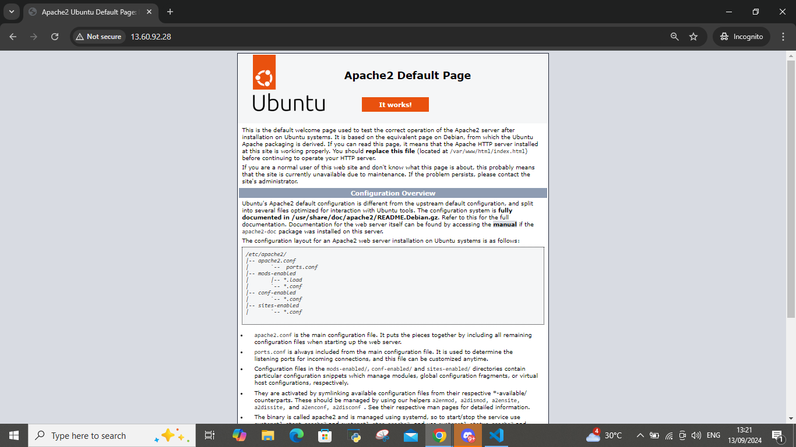
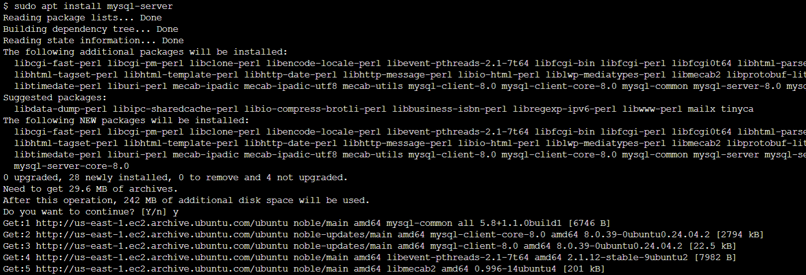
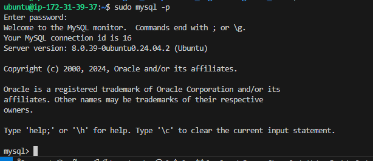
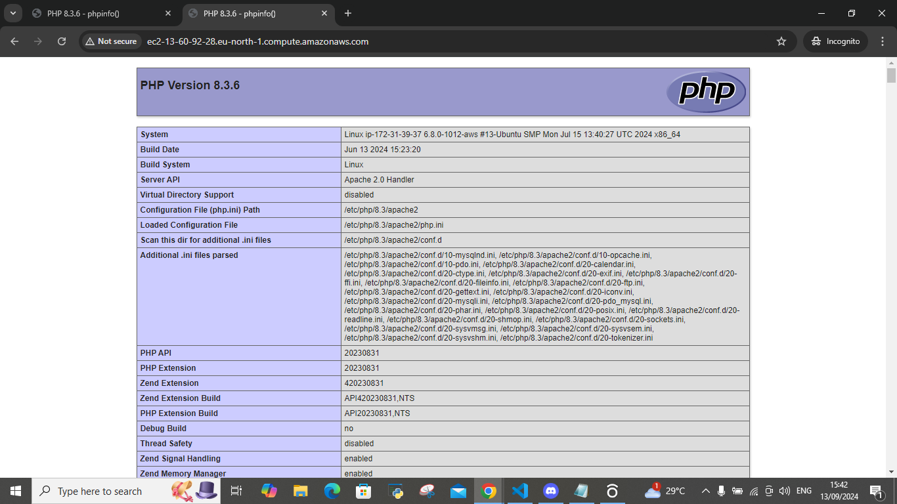

# LAMP_STACK PROJECT ON AWS
The LAMP stack is a collection of open-source software used to build web applications, these tools are put together to help make creation of the app easier,smoother and faster. It is also a widely used open-source web platform essential for developing dynamic websites and applications. With AWS, you can leverage the flexibility and scalability of cloud infrastructure to deploy LAMP stack efficiently, such tools include Linux, Apache, MySQL, PHP

Each component in the LAMP stack plays a critical role:

Static Badge Linux: The operating system that underpins everything. It's reliable, scalable, and commonly used for web hosting. Static Badge Apache: A widely-used web server software that handles HTTP requests and serves your website to users. Static Badge Mysql: A relational database management system (RDBMS) used to store and manage data in a structured way. Static Badge PHP: A server-side scripting language used to create dynamic web content by interacting with the database. Together, these technologies create a powerful platform for developing dynamic websites and applications.

Prerequisites AWS Account: To access the AWS Management Console. Basic Knowledge of AWS services: EC2, VPC (Virtual Private Cloud), and Security Groups. SSH Client: A tool for connecting to your virtual instance (e.g., Terminal for macOS/Linux, PuTTY or pem for Windows).

# Step 1: Launch an EC2 Instance Log in to your AWS Management Console. Navigate to EC2 under the "Compute" section. Click Launch Instance and follow these steps: Choose an Amazon Machine Image (AMI) Ubuntu 24.04 LTS (HVM) was lunched in the us-east-1 region or any region of your choice Select an instance type (e.g., t2.micro for free-tier eligible). Configure instance settings and choose your VPC/Subnet. Add storage (e.g., 8 GB default is fine). Configure Security Groups to allow traffic on HTTP (port 80), HTTPS (port 443), and SSH (port 22). Launch the instance, and make sure to download the key pair for SSH access.

# Step 2: Connect to Your Instance In the EC2 dashboard, select your instance and click Connect.

Use an SSH client to connect to your instance: ssh -i /path/to/your-key.pem ec2-user@your-ec2-instance-public-ip

```
chmod 400 my-ec2-key.pem
ssh -i "my-ec2-key.pem" ubuntu@13.60.92.28
```
Where username=ubuntu and public ip address=13.60.92.28

# Step 3 - Install Apache and Update the Firewall
* 1. Update and upgrade list of packages in package manager

sudo apt update
sudo apt upgrade -y


* 2. Run apache2 package installation

``
sudo apt install apache2 -y
``
If it green and running, then apache2 is correctly installed use these commands to start and check the status of apache2

```
sudo apt systemctl start
sudo apt systemctl status
```
* 3. __Allow Apache through the firewall:

'''
sudo firewall-cmd --permanent --add-service=http,
sudo firewall-cmd --permanent --add-service=https,
sudo firewall-cmd --reload
'''

* 4. __Confirm that Apache is working by visiting your EC2 instance's public IP in a browser

curl http://localhost:80
OR
curl http://youripaddress

* 5. Test with the public IP address if the Apache HTTP server can respond to request from the internet using the url on a browser.

http://13.60.92.28




# Step 4 - Install MySQL
* 1. Install a relational database (RDB)

```
sudo apt install mysql-server
```

Start and enable Mysql: When prompted, install was confirmed by typing y and then Enter.

* 2. Enable and verify that mysql is running with the commands below

```
sudo systemctl enable --now mysql
sudo systemctl status mysql
```

* 3. Log in to mysql console


```
sudo -u mysql -p
```


This opens up the mysql server and the user logs in directly, after logging in, anything can be done, from creating a password to creating tables and a lot more, first you would create a password for the root user The password used is "PassWord.1"

```
ALTER USER 'root'@'localhost' IDENTIFIED WITH mysql_native_password BY 'PassWord.1';
Exit the MySQL shell
```
```
exit
```

# Step 3 - Install PHP
* 1. Install php PHP is a server-side scripting language designed for web development. It can generate dynamic content and interact with databases. phpinfo(): A built-in PHP function that outputs information about the PHP configuration on the server.

The following were installed:

php package
php-mysql, a PHP module that allows PHP to communicate with MySQL-based databases.
libapache2-mod-php, to enable Apache to handle PHP files.

```
sudo apt install php libapache2-mod-php php-mysql
sudo yum install php php-mysql -y
```

Restart Apache to apply the PHP configuration

```
sudo systemctl restart httpd
```

Test PHP by creating an info.php file

```
php -v
echo "<?php phpinfo(); ?>" | sudo tee /var/www/html/info.php
```

# Step 4 - Create a virtual host for the website using Apache
* 1. Created the directory for projectlamp using "mkdir" command

```
sudo mkdir /var/www/projectlamp
```

Assign the directory ownership with $USER environment variable which references the current system user.

```
sudo chown -R $USER:$USER /var/www/projectlamp
```
* 2. Create and open a new configuration file in apache’s “sites-available” directory using vim. go into the file created

```
sudo vim /etc/apache2/sites-available/projectlamp.conf
```

Then paste in the bare-bones configuration below:

```
<VirtualHost *:80>
  ServerName projectlamp
  ServerAlias www.projectlamp
  ServerAdmin webmaster@localhost
  DocumentRoot /var/www/projectlamp
  ErrorLog ${APACHE_LOG_DIR}/error.log
  CustomLog ${APACHE_LOG_DIR}/access.log combined
</VirtualHost>
```

* 3. Show the new file in sites-available type the code to access the file, if you cannot access it,if you can't,cd into the directory itself

```
sudo ls /etc/apache2/sites-available
```

Output:
000-default.conf default-ssl.conf projectlamp.conf

* 4. Enable the new virtual host

```
sudo a2ensite projectlamp
```

* 5. Disable apache’s default website.

```
sudo a2dissite 000-default
```

* 6. to remove error in configuration run, make sure it does not contain syntax error

The command below was used:

```
sudo apache2ctl configtest
```

* 7. then reload apache for changes to take effect. this is very important

```
sudo systemctl reload apache2
```

* 8. The new website is now active but the web root /var/www/projectlamp is still empty. Create an index.html file in this location so to test the virtual host work as expected.

```
sudo echo 'Hello LAMP from hostname' $(curl -s http://169.254.169.254/latest/meta-data/public-hostname) 'with public IP' $(curl -s http://54.224.231.184/latest/meta-data/public-ipv4) > /var/www/projectlamp/index.html
```

# Step 5 - Enable PHP on the website
after going through all tose steps, you can now enable the website 
* 1. Open the dir.conf file with vim to change the behaviour

```
sudo vim /etc/apache2/mods-enabled/dir.conf
```
* 2. change the order of the index files to have index.php first

```
<IfModule mod_dir.c>
  # Change this:
  # DirectoryIndex index.html index.cgi index.pl index.php index.xhtml index.htm
  # To this:
  DirectoryIndex index.php index.html index.cgi index.pl index.xhtml index.htm
</IfModule>
```

The correct code would be

```
index.htm

        DirectoryIndex index.php index.html index.cgi index.pl index.xhtml index.htm

index.htm
```

* 3. Create a php test script to confirm that Apache is able to handle and process requests for PHP files.

A new index.php file was created inside the custom web root folder.

```
vim /var/www/projectlamp/index.php
```
Add the text below in the index.php file

```
<?php
phpinfo();
?>
```
* 4. refresh the page to see the final look image alt image alt remove the content after confirming it successful


```
sudo rm /var/www/projectlamp/index.php
```