# Load Balancer Solution With Nginx and SSL/TLS

A Load Balancer (LB) distributes clients' requests among underlying Web Servers and makes sure that the load is distributed in an optimal way.
In this project, we will configure an [Nginx](https://www.f5.com/go/product/welcome-to-nginx) Load Balancer Solution.

It is extremely important to ensure that connections to our Web Solutions are secure and information is [encrypted in transit](https://security.berkeley.edu/data-encryption-transit-guideline). Connection over secured HTTP (HTTPS protocol), it's purpose and what is required to implement it will be covered.

## Task
This project consist of two parts:
1. Configure Nginx as a Load Balancer
2. Register a new domain name and configure secure connection

The diagrame below shows the architecture of the solution
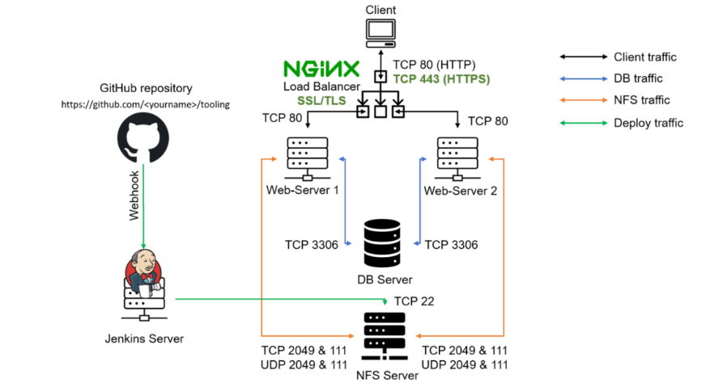


# Part 1 - Configure Nginx As A Load Balancer

 ### 1. Create an EC2 VM based on Ubuntu Server 24.04 LTS and name it nginx LB

 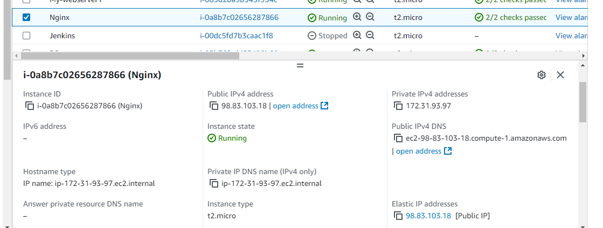

 __Open TCP port 80 for HTTP connections and TCP port 443 for secured HTTPS connections__

 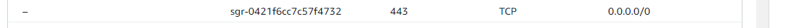


### 2. Update ``/etc/hosts`` file for local DNS with Web Servers' names (e.g ``web1`` and ``web2``) and their local IP addresses

__Access the instance__

```
ssh -i "Ezugwu-key.pem" ubuntu@98.83.103.18
```

__Update the hosts file__

```
sudo vi /etc/hosts
```
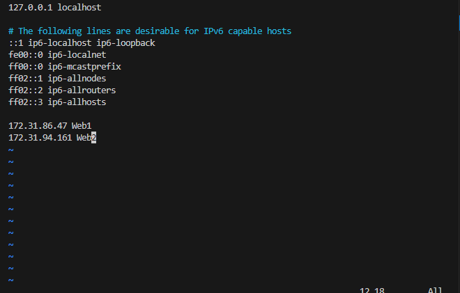


### 3. Install and configure Nginx as a load balancer to point traffic to the resolvable DNS names of the webservers

__Update the instance__

```
sudo apt update && sudo apt upgrade -y
```
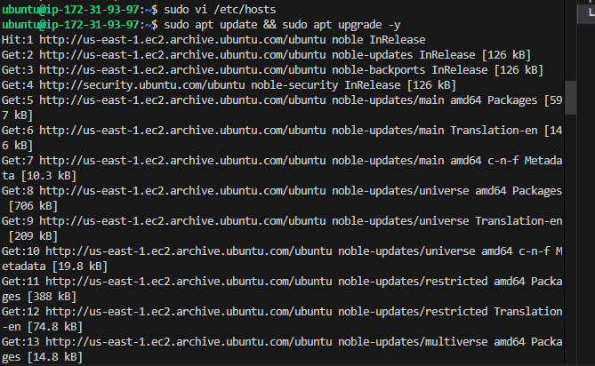

__Install Nginx__

```
sudo apt install nginx
```
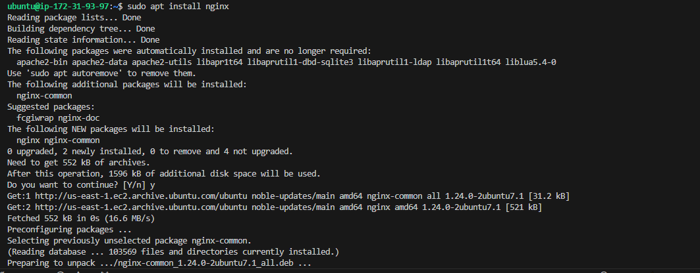


### 4. Configure Nginx LB using the Web Servers' name defined in /etc/hosts

This [blog](https://linuxize.com/post/how-to-edit-your-hosts-file/) provides more information about /etc/hosts

__Open the default Nginx configuration file__

```
sudo vi /etc/nginx/nginx.conf
```

__Insert the following configuration in http section__

```nginx
    upstream myproject {
       server Web1 weight=5;
       server Web2 weight=5;
    }

    server {
        listen 80;
        server_name ww.domain.com;

        location / {
            proxy_pass http://myproject;
        }
    }
    # comment out this line
    # include /ete/nginx/sites-enabled/
```

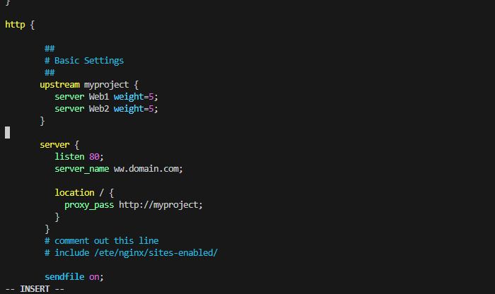

__Test the server configuration__

```
sudo nginx -t
```
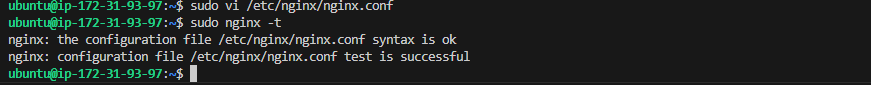


__Restart Nginx and ensure the service is up and running__

```
sudo systemctl restart nginx
sudo systemctl status nginx
```
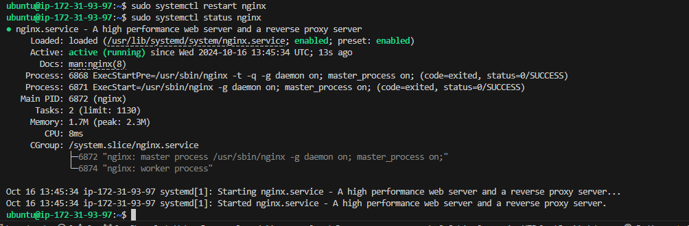


# Part 2 - Register a new domain name and configure secured connection using SSL/TLS certificates

In order to get a valid SSL certificate we need to register a new domain name, we can do it using any Domain name registrar - a company that manages reservation of domain names. The most popular ones are: [Godaddy.com](https://www.godaddy.com/en-uk), [Domain.com](https://www.domain.com/), [Bluehost.com](https://www.bluehost.com/).


### 1. Register a new domain name with any registrar of your choice in any domain zone. (e.g .com, .net, .org, .edu, info, .xyz or any other)

https://www.duckdns.org/domains is the domain name registrar used for this project.

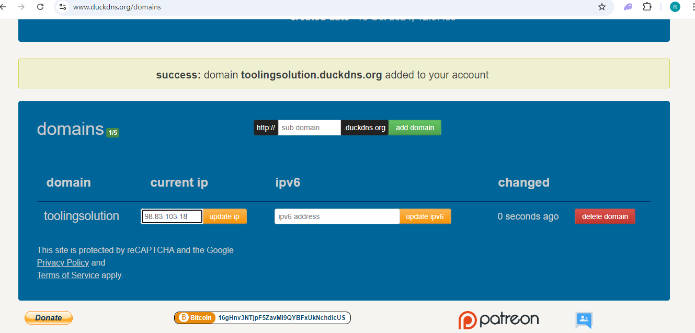

### 2. Assign an Elastic IP to our Nginx LB server and associate our domain name with this Elastic IP

This is neccessary in order to have a static IP address that does not change after reboot.

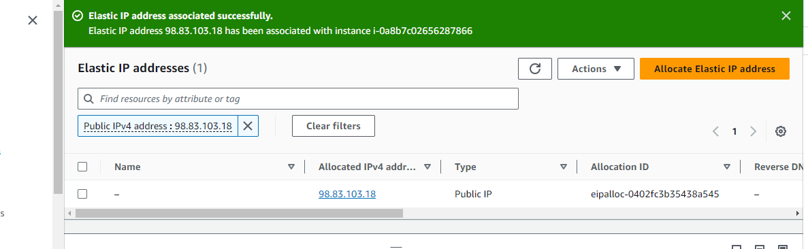

__Associate the elastic IP with Nginx LB__

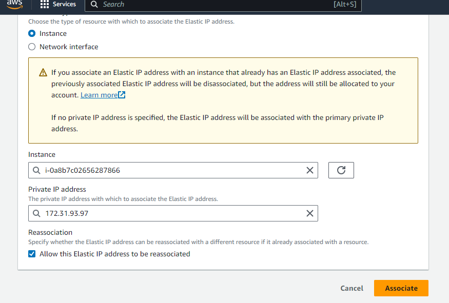

### 3. Update or create A record your registrar to point to Nginx LB using the elastic IP

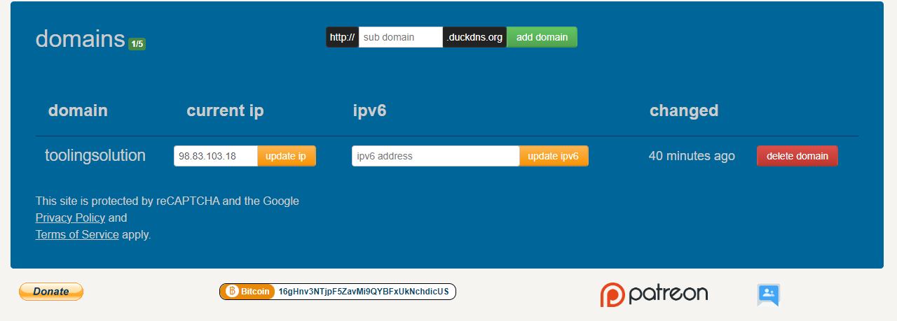

__Use [nds checker](https://dnschecker.org/#A/www.toolingsolution.duckdns.org) to Verify the DNS record__

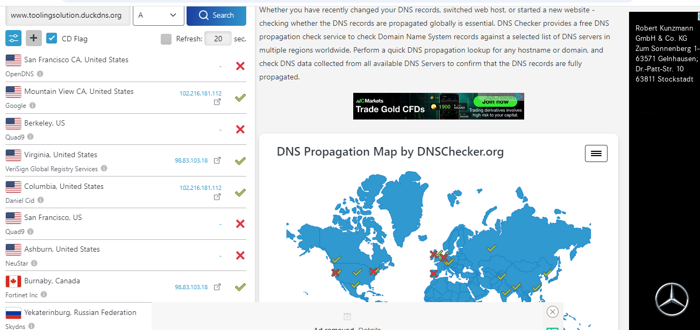


### 4. Configure Nginx to recognize your new domain name

Update your ``nginx.conf`` with ``server_name www.<your-domain-name.com`` instead of ``server_name www.domain.com``

In our case, the server_name is ``www.toolingsolution.duckdns.org``

```
sudo vi /etc/nginx/nginx.conf
```
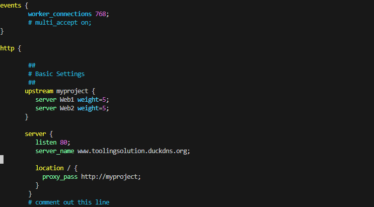

__Restart Nginx__

```
sudo systemctl restart nginx
```

__Check that the Web Server can be reach from a browser with the new domain name using HTTP protocol__.

```
http://<your-domain-name.com>
```
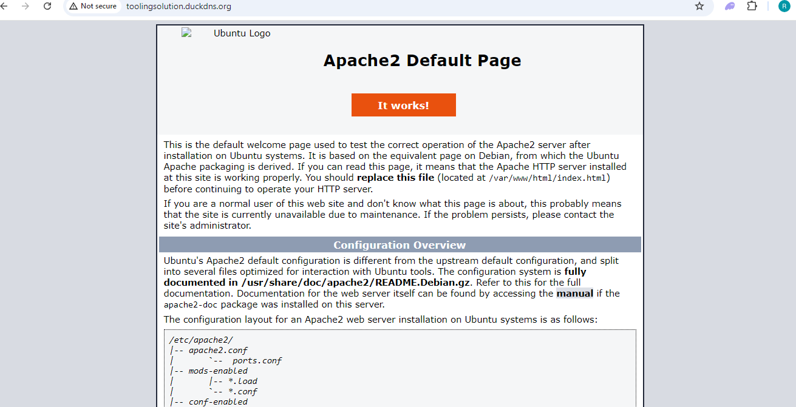


### 5. Install [certbot](https://certbot.eff.org/) and request for an SSL/TLS certificate

__Ensure [snapd](https://snapcraft.io/snapd) service is active and running__

```
sudo systemctl status snapd
```


__Install certbot__

```
sudo snap install --classic certbot
```
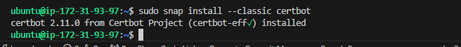

### Request SSL/TLS Certificate

__Create a Symlink in `/usr/bin` for Certbot__: Place a symbolic link in this `PATH` to make it easier to run `certbot` from the `command line` without needing to specify its full path.

```
sudo ln -s /snap/bin/certbot /usr/bin/certbot
```
Follow the certbot instructions you will need to choose which domain you want your certificate to be issued for, domain name will be looked up from `nginx.conf` file so ensure you have updated it on step 4.

```
sudo certbot --nginx  # This Obtains the certificate
```
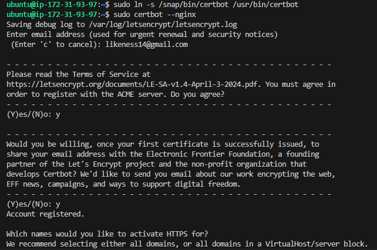

### Test secured access to your Web Solution by trying to reach `https://<your-domain-name.com>`.

You shall be able to access your wesite using HTTPS protocol (Uses `TCP port 443`) and see a padlock image in your browsers' search string. `Click on the padlock icon` and you can see the detail of the certificate issued for the website.

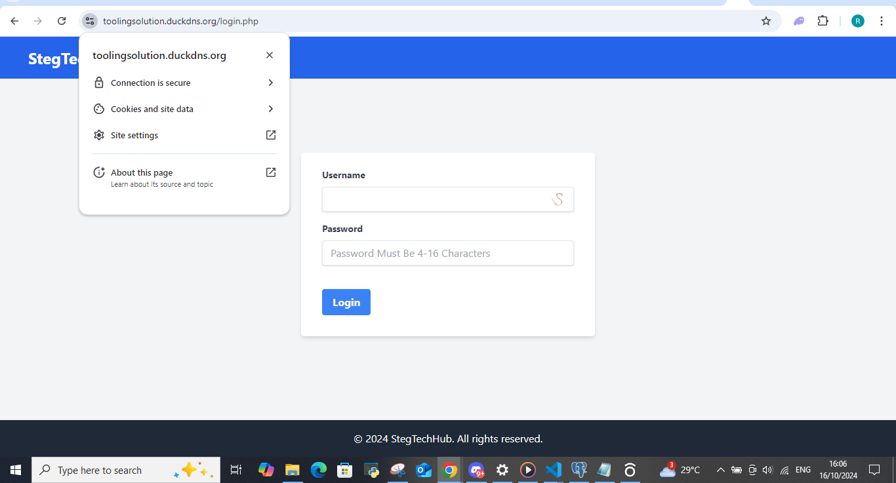
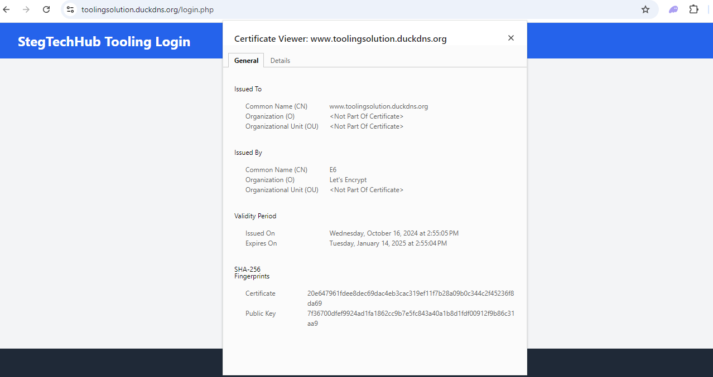

### 6. Set up periodical renewal of your SSL/TLS certificate

By default, `LetsEncrypt` certificate is valid for 90 days, so it is recommended to renew it at least every 60 days or more frequently.

__Test the renewal command in `dry-run` mode__

```
sudo certbot renew --dry-run
```
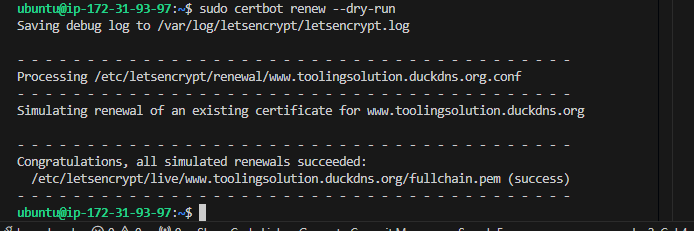

__Best pracice is to have a scheduled job that runs `renew` command periodically. Configure a `cronjob` to run the command twice a day__

__Edit the `crontab` file__

```
crontab -e
```
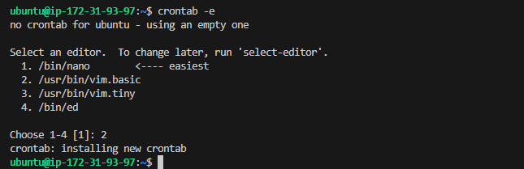

__Add the following line to scheduled a job that runs renew command twice daily__

```
* */12 * * *   root /usr/bin/certbot renew > /dev/null 2>&1
```
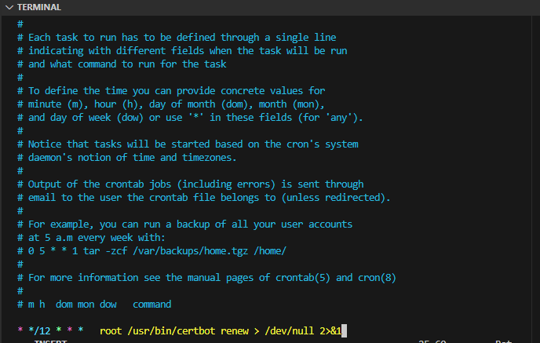


You can always change the interval of the cronjob if twice a day is too often by adjusting the schedule expression.

Resources on cron configuration:

[#30 - Job Scheduling (cronjob/crontab) on Linux CentOS 8](https://www.youtube.com/watch?v=4g1i0ylvx3A)

[Online cron expression editor](https://crontab.guru/)


